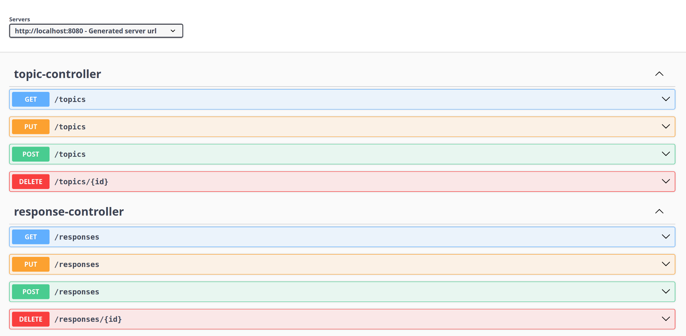

# Forum-Api
In that repository you found this packages in src/main/java/com.segonzalezz/api/Forohub: 
- domain
- infra
- controller
  
And implements this thecnologies:
- Flyway
- Lombot
- Security
- Jwt Auth0
- Starter Web
- Starter Validation
- Jpa
- Starter Test
- Flyway Postgrest Sql
- Postgrest Sql

#Images

 
  

